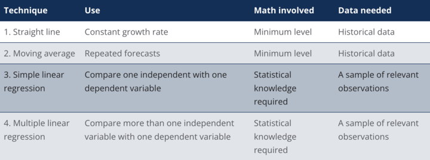

# What is Forecasting?

## Over the course of their work, businesses often have to evaluate their past performance in various areas to assess their success and project the direction they’ll take in the future.

As this task can be somewhat challenging, many businesses use business [analytics](https://rev.team/kb/what-is-analytics) which helps them go through relevant data and gain knowledge about their performance. One of the key techniques used in business analytics is known as forecasting.

### Definition

Forecasting is a statistical technique that works by employing historical data as a basis upon which those who use this technique can evaluate and predict upcoming trends in various areas. Forecasting is often used by businesses analyzing their performance and past practices, as well as by stock analysts and investors that want to know how well particular businesses fare.

#### Why Is Forecasting Important

In business practice, forecasting is used by companies in particular for the purpose of gaining insights into trends that can help them create suitable budgets, especially when planning ahead for future expenses. Companies also use the forecasting technique to come up with [benchmarks](https://www.bbgbroker.com/the-purpose-of-benchmarking-in-business/#:~:text=Benchmarking%20in%20business%20is%20a,function%2C%20or%20product%20in%20business.) for themselves — that is, to create a benchmark standard of their best practices from the past to which they can compare their future operations. Benchmarking is a process that requires an insight into company operations over prolonged periods of time in order to come up with more accurate forecasting.

Business managers often use forecasting to plan operations. In this process, they analyze historical data such as sales trends, as well as economic forecasts and intangibles (such as the introduction of new products or services by their businesses) to predict future sales. The sales forecast obtained in this way serves as the basis for different kinds of business planning, such as compiling production budgets, cash flow projects, and hiring goals.

Apart from businesses, forecasting is a technique used by other parties with similar concerns. This includes investors, who work with forecasting when trying to figure out if particular factors related to a particular company, such as sales expectations, for instance, can make the price of its shares rise (or drop). Based on these trends, investors make decisions on buying stocks or other securities from different companies.

Forecasting is also important for stock analysts, which employ this technique to figure out how particular trends (including GDP, unemployment rates, and so on) can change for each business quarter.

Economists can use economic data to forecast trends for different economic sectors. They formulate these forecasts in the form of economic models, which are then used by banks when setting their interest rates, and sometimes even by governmental bodies when creating economic policies.

Statisticians are another group that uses forecasting, particularly when analyzing how certain changes in some business areas can have an effect on particular processes. As an example, they can analyze how increasing salaries can affect the effectiveness of employees at the workplace.

#### How Is Forecasting Used

When businesses, analysts, and economists use forecasting, they analyze sets of [data](https://rev.team/kb/what-is-data) and make projections from this analysis before determining the variables related to the forecast. On the basis of what they can determine from their analysis, they pick a dataset to use when manipulating information. From analyzing this dataset they can come up with a forecast. Over a particular period of time, known as the **verification period**, they compare their forecast to the actual outcomes. Based on how accurate their forecast was, they can develop future forecasting models with better accuracy.

Stock analysts, in particular, forecast the increase or decrease of the price of stocks. To do so, they sometimes compare the earnings of particular companies to several economic indicators. They also observe how financial data changes over time to be able to make better forecasts.

It’s important to note that forecasts can often be inaccurate. This is usually due to unknown variables that can occur during the verification period. As these variables can usually not be predicted, they are not taken into consideration during forecasting which mostly relies on historic data instead, and can therefore significantly alter results and make them much different than what the forecast assumes.

With this in mind, the further out in time the forecast goes, the more likely it is that unknown variables will occur. This means that forecasts that project themselves to longer time periods in the future are more likely to be inaccurate, their accuracy declining proportionally with its time horizon.

### How to Forecast Revenue: Where to Begin?

There are many ways to forecast revenue effectively. Let's break it down.

Forecasting revenue is both art and science. You need to use both past performance and market data to forecast future revenue.

If you are in business for a long time, it is a good idea to use your revenue forecasts from the previous year to help predict what will happen in the next year.

You can then start to think about any changes you want:

* Personnel
* Products
* Industry Competition

Let's look at other ways to forecast revenue.

#### Revenue Forecasting: Bottom-Up Planning

This is one way to think about forecasting revenue in terms of your business.

Start by talking to your customers, current contracts, and opportunities. Then, put them all together to see where your money is coming from.

What happens if your forecast is not accurate? It is worth creating a plan to acquire new customers and estimating their value over time. This will help you determine if they are worth the effort and if they are a key part of your long-term success.

#### Revenue Forecasting: Top-Down Planning

You can also use a top-down approach to build a revenue forecast. Start by determining the size of your target market for your product. Analyze the market share of your competitors and determine how much you want to profit from that market.

Next, estimate your organic sales. To close the gap between that share and your goals take into account the cost of sales (how much it costs to acquire them) and the revenue (how much the sale is worth over its lifetime).

Calculate the Revenue team costs. Compare the results with your budget and adjust your plan accordingly.

### Revenue-Forecasting Techniques

Certain forecasting techniques and tips have proven to be a success for many businesses. These are three key techniques that can help you improve your revenue predictions.

**1. Forecast for each Product at the Right Level.** Most revenue forecasts include the expected market growth rate and sales for the current year. They also consider seasonality trends, average selling price, and the number of products sold.

However, some factors are more important than others so it is important to consider them at a more detailed level. For example, the forecast for a fast-moving product-A would be different than that for a slower-moving product B.

**2. Evaluate Sales Channel Productivity.** Your sales resources should coordinate your revenue predictions. Always discuss with sales reps what they can achieve and how quickly they can convert leads into customers. Sales quota planning is crucial for forecasting revenue, especially in B2B markets.

Revenue projections are dependent on factors such as the number and closing rates of potential customers.

**3. Cross-check Revenue Forecasts with Market Data.** Revenue leaders often discuss how much revenue is needed to cover all expenses and make significant profits. These discussions should always be based upon actual market data. Always check revenue forecasts against the macro view.

These revenue forecasting tips and techniques are taken care of by modern AI-assisted forecasting tools. We'll explain what AI-assisted revenue forecasting means below.

### Four Types of Revenue Forecasting Methods

*([Source](https://corporatefinanceinstitute.com/resources/knowledge/modeling/forecasting-methods))*

Financial analysts can use four types of revenue forecasting methods. The job description for a financial analyst is below. It shows the skills, education, experience, and knowledge required to be hired at a bank, institution, or corporation.

Financial forecasting, reporting, operational metrics tracking, financial data analysis, and financial models to predict future revenues.

Sales Revenue: This is the company's income from the sale of goods or services. Accounting refers to the terms sales, expenses, capital costs, and sales.

There are many tools for forecasting quantitative budgets, but this article will focus on the top four: (1) straight-line, (2) moving average, (3) simple linear regression, and (4) multiple linear regression.

#### Straight-line Method

Straight-line forecasting is the simplest of all the four revenue forecasting methods. Financial analysts use historical trends and figures to predict future revenue growth.

#### Moving Average

Moving averages are a smoothing tool that examines the underlying patterns of data to estimate future values. The most popular types are the 3-month- and 5-month moving averages.

#### Simple Linear Regression

Regression analysis is a popular tool to analyze the relationship between variables to predict their future. We will examine the relationship between revenue and radio ads in this example by running a regression analysis of the two variables.

#### Multiple Linear Regression

Multiple linear regression is used by companies to forecast revenues when there are two or more variables. It will determine the relationships between promotion costs, advertising costs, and revenue numbers.

### Summary

Forecasting is a technique that uses historical data to predict upcoming trends in various areas. It’s often used by businesses analyzing their performance, as well as other parties interested in this performance such as investors, stock analysts, and more.

Businesses use forecasting to gain insights into trends, upon which they can base their budget preparation, as well as for benchmarking purposes. Business managers use forecasting to plan operations, a process that includes analyzing historical data, economic forecasts, and various intangibles to predict future sales.

Investors use forecasting to figure out whether particular factors related to the operations of companies can make the prices of their sales increase or decrease. On the basis of this analysis, they can decide whether they want to invest in particular companies.

Stock analysts use forecasting to predict if trends such as GDPs and unemployment rates will change during the upcoming business quarter. Economists forecast trends for different economic sectors and come up with economic models, which can be used by banks when setting interest rates, as well as by governments when creating economic policies. Statisticians also use forecasting to analyze how certain changes in different business areas can have an effect on particular processes.

When forecasting, businesses and economists analyze particular datasets before determining the variables related to the forecast. They pick the most suitable datasets to manipulate information with and then come up with a forecast, whose accuracy is tested during a verification period. It’s important to note that the longer the future period for which the forecast is projected, the likelier it is that this forecast will be inaccurate because of unknown variables.