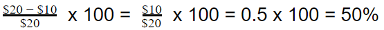

# What is Gross Margin?

## For companies, increasing the overall health of their business is a key challenge, and maintaining this health is something they constantly concentrate their efforts on.

To determine how healthy their business is at each point in time, companies often evaluate several factors that serve as key indicators of business health.

Many of these factors are related to revenue and profit in one way or another — the ability of a company to maintain a steady income as time goes by is indicative of how well a company can adapt to the marketplace and sustain itself in the long run.

One of the metrics companies use to measure their success at generating revenue is the gross margin.

#### Definition

The term gross margin, also known as gross profit margin, refers to a metric that represents the difference between a company’s [net sales](https://strategiccfo.com/net-sales/) and its [cost of goods sold (COGS)](https://rev.team/kb/what-is-cost-of-goods-sold-cogs). In essence, this metric is used to display the amount of revenue a company keeps from its sales operations after it pays off all the deductions that come directly from the production of the goods and/or services it sells to [buyers](https://rev.team/kb/what-is-buyer).

#### How Companies Measure Their Gross Margin

To calculate a company’s gross margin for a particular time period, the following formula is used:

**Net sales revenue − Cost of goods sold (COGS) = Gross Margin**

Here, the two parts of this equation can be described as:

* The **net sales revenue** is the complete amount of money that a company earns by selling its products or services for the time period for which the gross margin is being measured. This type of revenue is sometimes simply referred to as net sales. In some cases, when a company gives discounts or monetary deductions to customers complaining about or asking to return the products or services they bought, these reductions of the real price are accounted for when measuring the company’s net sales revenue. Because the net sales revenue is located at the very top of a company’s [income statement](https://www.zoho.com/books/guides/what-is-an-income-statement.html), it’s commonly referred to as the [top line](https://www.wallstreetmojo.com/top-line/). This differentiates it from the company’s [bottom line](https://www.indeed.com/hire/c/info/what-is-the-bottom-line-in-business-a-guide-for-managers), which represents its net income after subtracting costs from its revenue.
* The **cost of goods sold (COGS)** represents the combination of all direct costs that a company incurs to produce the items (products or services) it sells for a profit. These costs account for the wages for the workforce, the raw materials needed for production, particular parts needed to produce a product, utilities, rent, storage, and more.

To demonstrate the calculation of a gross margin with an example, let’s say that a company generates **\$100,000** in net sales revenue for selling its products during a particular time period — a month, a year (commonly a fiscal year), a fiscal quarter, or any other interval. During the same period, the company incurred a total of **$40,000** in COGS, including the salaries it paid to its workforce, the raw materials it used to produce the products it sells, the rent for the building where it produces these products, the utilities for the same building (water, gas, electricity) and so on. With this in mind, to calculate its gross margin for the time period in question, the company has to use the following equation:

**\$100,000 − \$40,000 = $60,000**

This means that the company has a gross margin of **$60,000** for that particular time period.​

#### Ways to Express Gross Margin

In most cases, when used as a metric, the gross margin is expressed in one of two ways: as a percentage of revenue or on a per-unit basis.

### Gross Margin as a Percentage

The gross margin percentage is the most common way to show what part of the sales revenue (that is, the price of a product or service) is retained by the company as a profit. This percentage is calculated by using the following formula:

To demonstrate this with an example, let’s say that producing a single product costs a company a total of **\$10** in COGS. The company sells this product on the market for **$20**. To calculate the gross margin percentage on this product, the company has to use the following equation:

This means that for this particular product, the company has a gross margin percentage of **50%.**

### Gross Margin on a per-Unit Basis

When gross margin is calculated per unit, it means that it’s compared against specific units that each company commonly uses as a basis for comparisons, among other things. These units represent a particular amount of goods relevant to a particular business, with examples including a bucket of paint, a ton of butter, and so on.

To demonstrate this with an example, let’s say that a company that makes cookies spends a total of **\$1** in COGS to produce a single package of cookies, which it considers a unit. On the market, this company sells one package of cookies (i.e. one unit) for the price of **$3.** To calculate its per-unit gross margin, the company would have to use the following formula:

**\$3 − \$1 = $2**

Therefore, the company’s per-unit gross margin is **$2.**

#### Why Are Gross Margins Important

The gross margin metric is significant for companies measuring it because they use it to figure out what part of the overall revenue they generate stays in their possession in the form of gross profits. If, for instance, a company boasts a 50% gross margin for its past fiscal year, this effectively shows the company that for each \$10 of net sales revenue, it keeps $5 as an effective gross profit for itself. Since this profit accounts for pure earnings after the basic costs needed to produce the goods sold have already been taken out of the picture, companies can make plans on how to allocate them to other important expenses such as to pay off their debts and interest rates, cover administrative costs they may incur, and distribute dividends to their shareholders.

Measuring trends and variations in a company’s gross margin is indicative of the relationship between its revenue and the costs it incurs. Companies that notice that their gross margins have started to fall, for instance, may be inclined to either reduce their COGS (by reducing salaries, decreasing their workforce, spending less on raw materials, and so on), increase the prices at which they sell their products or services, or do both.

Business analysts often evaluate companies by comparing their gross margins, which are widely considered an indicator of how efficient their businesses are. When a company boasts high gross margin rates, it means that it capitalizes on more revenue, and can use this extra capital to invest in its own betterment further down the line.

#### Gross Profit Margin vs. Net Profit Margin

Net margin, sometimes also called net profit margin, is a metric very similar to gross margin in its use, with a very significant difference. Namely, by measuring their gross margins, companies can simply evaluate how profitable their production is. When they measure their net margins, on the other hand, companies can understand how profitable their businesses are as a whole, not limited to their production aspects.

This is because a company’s gross margin only takes the COGS into account, subtracting it from its net revenue to come up with a gross profit rate. Net margin, on the other hand, takes all company expenses into consideration — including COGS as well as indirect expenses such as market placement costs for goods, [compensation](https://rev.team/kb/what-is-compensation) for non-workforce members such as sales professionals (usually in the form of [commission](https://rev.team/kb/what-is-commission)), tax-related payments, and other expenses related to the company’s business operations. When subtracting all these expenses from the net revenue, the net margin shows the net profit that companies get to cash in at the end of the day, without any need to reinvest this profit anywhere. Therefore, net margin is a more in-depth indicator of company profitability than gross margin.

#### Summary

Gross margin, also known as gross profit margin, is a metric that demonstrates the difference between a company’s net sales and its cost of goods sold (COGS). The metric shows how much of its net revenue a company keeps after having paid for the direct expenses associated with the production of the goods it sells.

For a company to calculate its gross margin for a specific period of time, it needs to subtract its COGS from its net sales revenue. The most common way to display the gross margin is as a percentage, showing what part of the price for a product or service is retained as a profit by the company. Gross margin can also be shown on a per-unit basis, where each unit is a particular quantity of goods relevant to and determined by each company individually.

Gross margins are important for companies because by measuring them, they get a clear idea of what parts of their net revenue they retain in the form of gross profits, which they can then spend on a variety of indirect expenses such as debts, interests, administrative costs, dividends, and more. Companies that notice a decreasing trend in their gross margin are more likely to slash their COGS costs, increase the prices of their products and services, or both.

Analysts use the gross margins of different companies to compare their effectiveness. Companies with high gross margins capitalize more on their revenue and can invest the capital they retain in future improvements.

Net margin is a similar metric to gross margin. The difference between these is that, while gross margin only shows the revenue companies retain after expenses related to COGS, net margin shows the net profit companies keep after all direct and indirect expenses they incur.