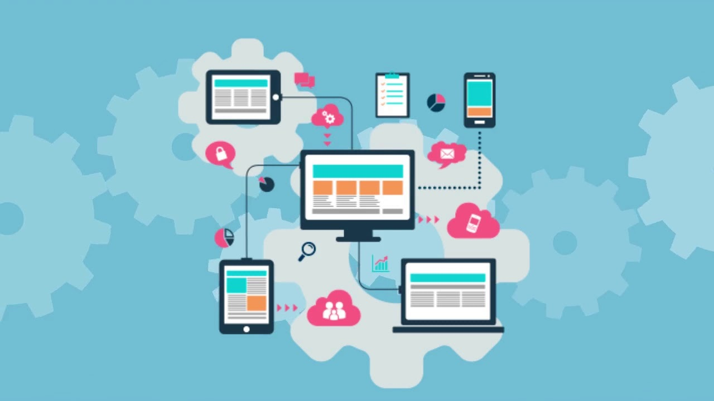
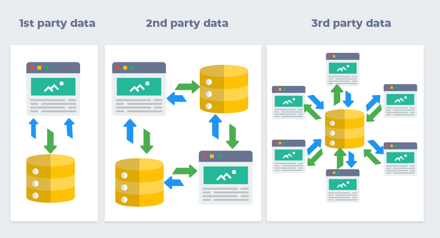
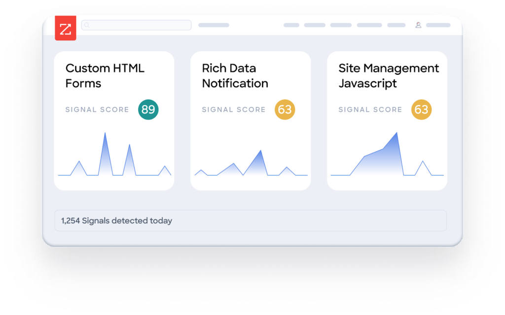

# What is Intent Data?

## Intent data can help you understand what people are intending to do before they take action. 

### Definition

Intent Data is a type of sales intelligence that shows which accounts or leads are actively researching third-party sites. If research on a topic is more than usual, accounts will experience a spike in interest.

Buyers often use online research to solve problems. They may narrow down their options before you have even had the chance to meet them. Imagine if you knew that your prospects were searching for a solution similar to yours soon after they started the process.

These behavioral signals allow Revenue teams to prioritize accounts that are interested in relevant topics over similarly qualified accounts that don’t have intent. B2B intent data can be used to increase Revenue if used correctly.

Different Lead Data tools help your Revenue Team find accounts that are relevant to their business by consuming:

* Review of product
* Blogs and infographics
* Comparison of products
* Case studies
* General news

Online intent data can be collected and used by organizations to reach buyers earlier in the process. Forward-thinking companies have a huge opportunity with buying intent indicators

> *"In theory, the digital footprint created by B2B buyers may be larger or have more depth and breadth.  Why is it so much easier for a small floral delivery company to target a B2C customer online than a 1,000-person data security firm that only provides its services to financial service companies based in the United States?"*

*Forbes* interview with Henry Shuck, ZoomInfo CEO

### How is Buyer Intent Data collected?

Content consumption is a strong indicator of buyer intent data. This data can be accessed by purchasing it from a third party.

These intent platforms aggregate online research activity from thousands of B2B websites, media publications, and other sources.

They aggregate activities every week to create baselines for each company’s average content consumption over time. They also look for spikes above the normal levels of topic search. As prospects search for solutions and products, they also analyze billions upon billions of online browsing events.

It's difficult to act on raw data. Data vendors often include several indicators in their algorithms to generate a spike:

* Content consumption
* Number of consumers
* Types of content consumed
* Time on the page
* Scroll speed

Providers can use company spike data to provide relevant information in a non-obtrusive manner at the right time during their research journey.

It helps down-funnel sellers to focus their time when these opportunities are coming to fruition. They also want to hear from them.

#### How does Intent Data differ from other web tracking data?

You can track potential buyers' visits to your website and increase your lead scores. You can also track who visits your website and nurture them with email and ads to help them convert.

Great. What about prospects who are looking for solutions to their problems?

What if they are researching other websites? You don't have any visibility into your prospects' activities or implied intent when they visit other websites.

#### How do you use B2B Intent Data?

Intent data can be used by Revenue teams to create effective go-to-market strategies, segmentation, and targeted outreach to the right people.

Companies that don’t use predictive intelligence data are restricting their ability to respond to data from their website. However, their potential buyer may have been trying to solve a problem for weeks.

Intent data will be used in five main ways for Revenue teams:

1. **Identify early buyer interests.** Purchase intention signals help you identify companies that are actively researching your solution before they fill out forms on your site or interact with your Revenue team.
2. **Create targeted accounts lists.** Dynamically filter out accounts that are of active interest to them.
3. **Personalization.** Personalize their initial outreach to better match accounts' needs.
4. **Prioritizing accounts and lead scoring.** Use predictive purchasing data to evaluate your lead scoring model. Prioritize companies that show interest and purchase intent before they start the buying process with a rival.
5. **Analyze and retain customers.** Real-time visibility of which customers are researching solutions and the research topics. These insights allow you to up-sell proactively, identify pain points, and prevent customers from abandoning or refusing to buy an offering they didn’t know you had from a competitor.

#### Why is predictive data important for B2B sales?

TOPO's Intent Data Market Guide reveals that B2B intent data is the fastest-growing data category in the last three years. It has changed the way teams plan their time and provides insights about accounts.

Translation: If your competitors aren't using it yet, they might be thinking about it.

### Types of Intent Data

*([Source](https://www.affdu.com/es/intent-data-for-inbound-and-abm.html))*

There are three types of intent data: First, second, and third-party.

#### First-Party Intent Data

This refers to information you already have on anonymous visitors and known contacts. It can include interactions with your website, emails, and social media channels. It can be used for segmenting communications, creating workflows, scoring leads, and helping Revenue Teams to intuit how to approach prospects.

#### Second-Party Intent Data

Another company may collect data on second-party intent. Review sites and publishing networks are common sources of second-party intention data. The user permits the company to share their behavior, sometimes with their contact information.

#### Third-Party Intent Data

Although data on third-party intent can be collected from any site on the internet, some models only monitor one site. This data can be mined using three methods: Reverse IP lookup, bitstream information from ad networks and widgets, and media exchange/publishing members.

### Common Uses of Intent Data

* Building highly targeted prospect lists
* Account-based Marketing (ABM)
* Scaled personalized outbound sales
* Remarketing to competitor prospects
* Event promotion
* Churn reduction

### Evaluation of Intent Platforms

Here are some crucial questions to ask when evaluating intent data providers:

* Do the data relate to leads, accounts, and/or both?
* How wide is the coverage?
* Can the provider provide context? Is the provider able to provide context?
* Is this data integrated into your existing system, CRM, or scoring model?
* How often do you receive your intent updates?
* Can you customize the topics that you track?

Intent data is real-time and not in batches.

*([Source](https://pipeline.zoominfo.com/sales/how-to-use-intent-data))*

### Summary

Now that you've learned what is intent data, it's important also to know that like all data, intent data is not perfect. Intent data that focuses only on buyers who have shown intent will invariably exclude buyers who are interested but are not captured by the model of the intent data provider.

Revenue Teams can be too focused on intent data and end up prioritizing quick wins over building a sustainable pipeline. B2B intent data is most effective when it is paired with other data. This creates a scoring system that also reflects engagement and fit.

When used correctly, intention can be a powerful predictor of which accounts will buy.