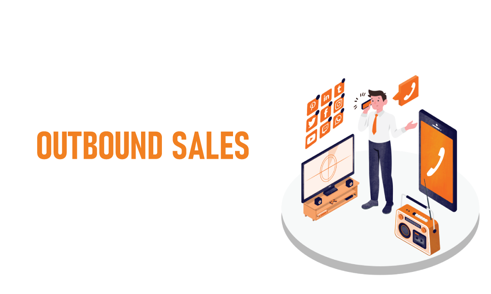
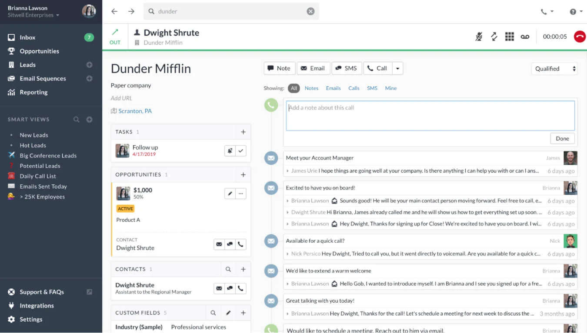
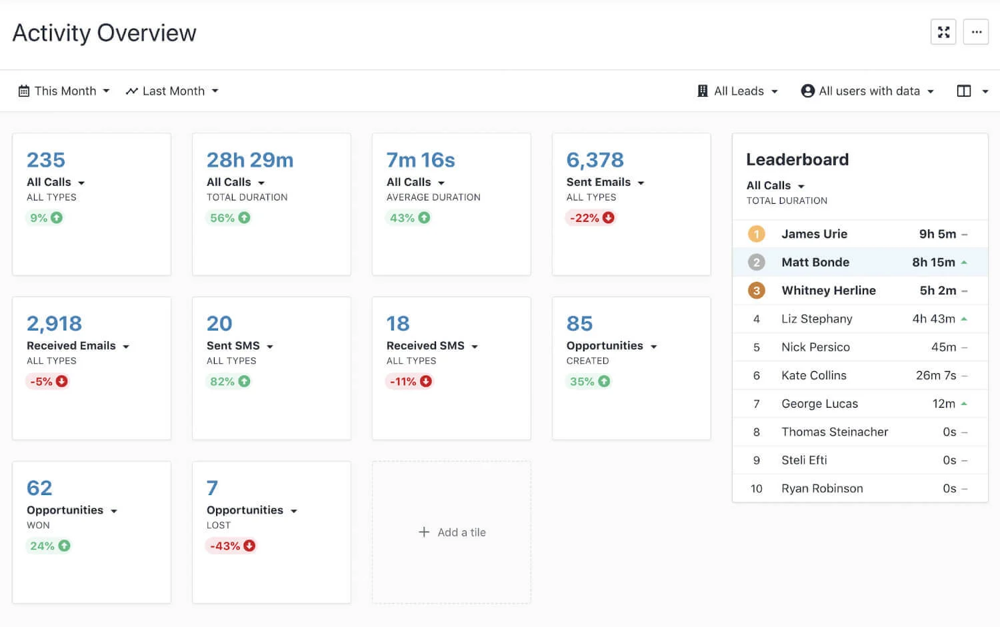

# What are Outbound Sales?

## Outbound sales is a type of selling where the seller reaches out to potential customers to generate interest and close deals.

Outbound sales is often used by businesses that are looking to expand their customer base or sell new products or services.

### Definition

What are Outbound Sales? It is the process by which sales reps make outbound calls or use other sales channels to reach prospects. Outbound sales are where a seller (usually a sales rep) initiates contact with a potential buyer.

This is in contrast to inbound sales where the potential buyer initiates the conversation.

Outbound sales can involve cold-calling leads from a list. However, reps often call quality leads who have previously shown demand by engaging with a brand's content or filling out forms, emailing a company, or making a call to a company.

#### When to use Outbound?

Outbound sales can be a great way for your business to generate quality leads because they allow you to reach out to people who might not have seen your ads.

This is most effective if the person/company has expressed interest in similar products or services from other companies. It's like finding new prospects who want what you have.

If the company is trying to position itself in a new market or niche, outbound sales can be used to generate leads and convert prospects into customers.

#### Outbound Sales for B2B Companies

Reps sell to potential companies in business-to-business sales. B2B sales are more complex and require multiple touchpoints. B2B outbound reps are responsible for following up with prospects.

It is crucial for B2B sales reps that they log activities in CRM tools such as Salesforce so that all members of sales teams know the status of a lead in real-time.

#### Outbound Sales to B2C Companies

B2C companies often have inside sales reps who sell lower-ticket items and transnational sales. B2C companies include companies that sell stocks, insurance policies, and timeshares. B2C reps are often required to dial more leads per day than B2B reps, as B2B prospecting is more strategic and less emotional.

#### The Benefits of Outbound Sales

Outbound sales can be very effective because it offers the things that inbound (usually) doesn’t:

* Targeted outreach.
* Instant feedback and results.
* Contact prospects by phone.
* You have control over the pace of selling.

Outbound sales are a powerful channel to generate revenue because of these benefits. Instead of waiting for your ideal customers to come to you and wait, you can reach them directly. You'll also find out immediately if your approach is working.

You control the pace at which you sell and how you scale it. Want to increase sales? Reach out to more prospects.

Combining inbound and outside bound sales strategies can help you get the most from your sales process. 

### A Look at the Outbound Sales Process

Each company has a unique outbound process, but there are five steps that every outbound sales representative must follow. Here's an overview of what this usually looks like:

#### 1. Identify Market Segments

Who are you selling to? What is your target audience? This information will allow sales teams to contact the right people.

Segmenting your market into smaller groups can help tailor your sales approach. This is especially important if your products or customers are from different verticals.

#### 2. Generate Leads

Although lead generation is a complicated topic, it all boils down to filling your pipeline. You can generate leads by creating a list of people that you want to reach out to and then finding their contact details.

Salespeople can handle lead generation.

#### 3. Outreach and Qualification

This is when your sales team begins to take action. Salespeople can contact leads by phone, email, and other methods.

Salespeople will assess a lead's likelihood of becoming a customer by their first interaction with them. This is what sales qualification is.

If they don't, they will be removed from your contact list. They'll be promoted to the next stage if they're qualified prospects.

#### 4. Meetings and Sales Calls

Your team can now do what they love: sell. This could be a live demo, a meeting with executives, or a phone call to discuss the benefits and features of your product.

This process can take up to a year depending on the target market. B2B sales and enterprise sales have longer sales cycles and more decision-makers. Sometimes, smaller sales can be closed in one call.

#### 5. Closing the Deal

If the meetings and calls are successful, it's now time to sign the contract. Your sales team has closed the deal. There are still many things to do, but your sales team is done.

### Creating an Efficient Outbound Program

You might think that setting up an outbound team involves just hiring a few salespeople, and then giving them a list to call. Outbound is more than just hiring a few salespeople and giving them a list of people to call.

You must build a strong team and develop sales strategies that will help close deals. This requires a lot of scientific thinking and experimentation. 

#### 1. The right team is essential.

Outbound selling can be done even if you are the only person in your company. However, a team will be a huge help if you want to build a sustainable outbound sales process.

So who should you hire? Some people hire for their industry experience. Some salespeople must pass in-person exams. You could hire hustlers rather than industry veterans.

Find outbound salespeople with potential and nurture their skills and attitudes. They will help you improve and create your process.

It is a good idea also to hire more outbound sales representatives. In the long-term, it pays off to have more freedom for experimentation, competition, and a backup in case someone isn’t available.

Close's built-in sales leaderboards allow you to compare the sales activity of each member of your sales team. This allows you to gamify friendly competition. This will keep your team motivated by allowing you to compare the number of calls made, emails received, minutes spent talking with prospects, and other metrics.

#### 2. Create ideal buyer personas.

You now know who your target audience is. It's time to get even more specific. It is important to know their job titles.

What articles are they looking for? What problems do they have and what solutions are they looking for? What keeps them awake at night?

A buyer persona succinctly summarizes all of this information. This persona is a valuable tool for your salespeople.

You may already have some of the information needed to create a buyer persona. It's worth ensuring you have as much information available as possible. Talk to your contacts, customers, and even strangers.

Remember that you might have multiple buyer personas. It all depends on the number of products you sell and the types of people they appeal to.

#### 3. Get down to the essence of your value proposition.

Why should your ideal customer purchase from you? Your value proposition is the answer to that question.

It is important that every salesperson can clearly articulate it on demand and without hesitation.

You may find your value proposition changing over time. You might find customers using your product for reasons you didn't anticipate, or you may need to reposition the brand to reflect new competition.

It is a mistake to jump into outbound sales without a *compelling* reason why people should buy from your company. Your salespeople will find it easier to sell if your value proposition is compelling.

#### 4. Start generating leads.

Now your salespeople know who they are selling to and what value proposition appeals to them. Now it's time for you to start selling.

Today's lead generation methods almost exclusively focus on inbound:

* Blog posts and online guides published
* Podcast guests
* Hosting events
* Social media authority building
* Participating in conferences

These methods of lead generation all work to get people to contact you. They're scalable, sustainable, and -- generally -- don't require a big investment of cash, though they often take a lot of time.

There are also outbound methods for lead generation. Print ads, outdoor advertising, and direct mail are all still viable methods of lead generation. Paid lead databases can be extremely useful, but you need to be cautious about how much information you trust.

Your industry, sales process, and growth-stage will determine the best method for your company. Many companies will use multiple methods.

It is worth taking the time and figuring out which method works best for your company. 

#### 5. Start selling and plan your outreach.

You need an outreach plan. Here are some suggestions for what to include.

* Decide whether to call or email first.
* How long should you wait to follow up on a voicemail?
* What format should the follow-ups take?
* Send specific messages to your calls and emails.
* Timelines for ongoing follow-ups.

You can draw on your experience selling your product or service. If you don't have any experience selling your product or service, you can start by identifying what appeals to your audience and build from there.

While your plan will change as you discover what works and doesn't, you should have a rough guide of how your salespeople should perform at their jobs.

Once you have a plan in place, you can start selling. Make sure everyone understands how to implement your plan and then get them on the phone!

### Summary

Now you understand what is outbound sales and how to apply it in your business to generate leads. This method is worth considering if you have the time and resources. However, it can be more costly than traditional lead generation methods.