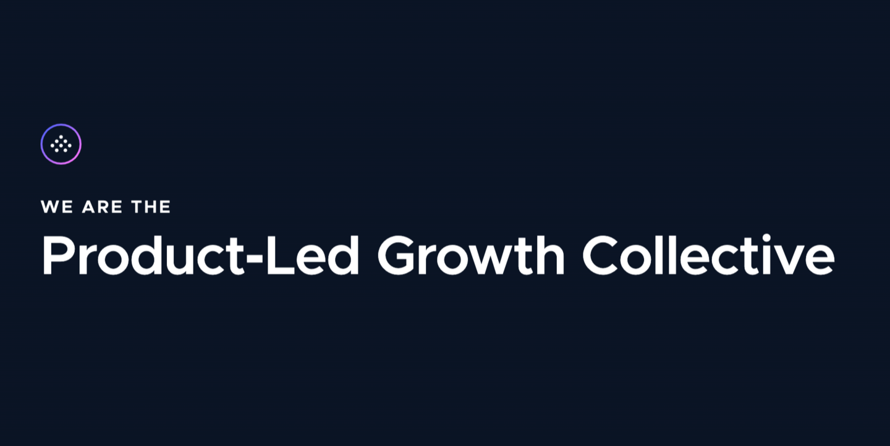
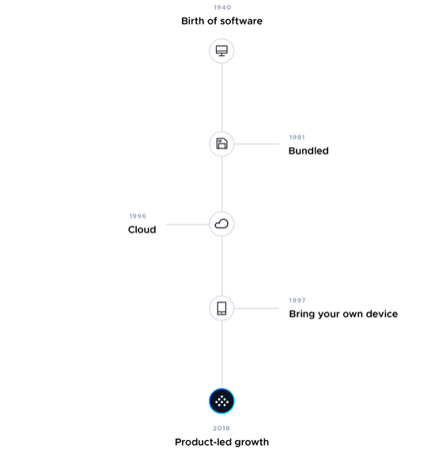
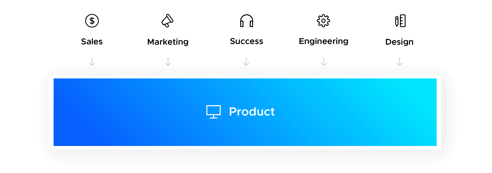
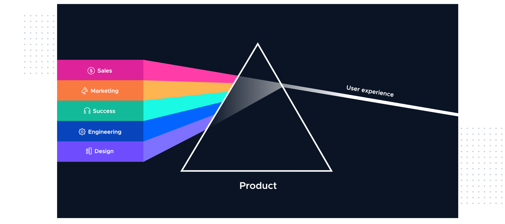

# What is Product Led Growth?

## In this article, we'll discuss what is product led growth (PLG), what makes it unique, the benefits it offers businesses, and how growth companies can go about incorporating it into their strategies.

#### Appcues founded the Product-Led Growth Collective in 2019

It is not an easy road to becoming product-led. The Product-Led Growth Collective was started by us because it wanted to be part of a community. It wanted to share ideas, learn from others, and talk shop.

It is at the forefront of a major shift in how people use and purchase software.

Salesforce has been offering cloud-based software for more than a decade. With the introduction of the iPhone in 2009, Apple made digital experiences accessible to everyone. In the years that followed, the market has seen a flood of consumer and business products that promise to fulfil every need.

Today's most extraordinary product user experiences are not as exciting as they were yesterday.

*([Source](https://www.productled.org))*

This is what makes this shift more significant than any others we've seen. It's a shift both in consumer demand and market supply. Tech-savvy users are driving the transition to consumer-grade UX in B2B SaaS products, often called consumerization.

They want software that is more beautiful, intuitive, powerful, and less expensive than their previous tools.

Buyers want to learn by themselves. A 2015 Forrester study found that 75% of B2B buyers would rather shop through an app or website than a salesperson. Personalization is expected.

Not only are 80% more likely to do business in a company that offers personalization, but Salesforce's 2017 State of Marketing report revealed that 52% of B2C clients would switch brands if they didn't get a personalized experience. People want instant gratification and will abandon products that don’t offer it. For instance, 21% of people open a mobile app once and then abandon it completely.

By the 90-day benchmark, 71% will have abandoned the app completely.

These consumer demands are being met by the market, which is generally rising. It's easier than ever for a company to be started. More companies equal more competition. Consumers have an ever-growing number of products that meet their expectations.

This has led to a decrease in user patience for legacy software that isn't up to their standards. People are now more willing to abandon products that don't meet their expectations. In the 2019 SaaS Trends Report, Blissfully discovered that the average mid-sized business saw a 39% turnover last year in their SaaS stack.

*What does this all mean for the future product?*

A great customer experience is key to success. Sales was responsible for creating that experience. A salesperson was the best person to talk to if you were looking to purchase a new product.

If you were lucky enough, they were knowledgeable and sympathetic and could help you choose the right product for you. The internet gave digital marketers the ability to measure their results and set growth metrics such as acquisition and engagement.

People don't want to be contacted by salespeople or marketers anymore. They want to experience the product. Businesses must rethink their marketing, sales, and service strategies to keep up with the market.

They also need to rethink their customer-facing roles. Both marketing-led and sales-led growth were once popular. Product-led growth is the future.

### Definition

Product-led growth (PLG), is a business model in which user acquisition and retention are driven primarily by the product. It promotes company-wide alignment among all departments, from engineering to sales and marketing, around the product as the greatest source of sustainable, scalable business development.

We created the product-led prism to help you understand how a product-led strategy works.

The rainbow effect is created when light passes through a prism. Each color has a specific wavelength and refracts at different angles.

The product-led prism does the same thing but in reverse. The different colors represent the different teams (marketing, sales, CS design, engineering) that normally operate on different wavelengths. Instead of separating them, the product-led prism brings them together.

They combine wavelengths to create the bright, focused light that the user experiences.

We should also be clear: Product-led growth doesn't mean PM-led growth.

PLG is about leveraging the contributions of your entire company to build better, stickier products. It is *not* all about creating an autocracy.

It is the democratization and promotion of a product. Like any democratic system, product-led growth requires that traditional decision-makers open up their decision-making process for a wider range of stakeholders. This creates more complex and difficult discussions.

Are difficult, complex discussions more effective in generating innovative business decisions? Absolutely.

You can also continue to scale by hiring. This will almost guarantee that your company won't move fast enough, will not respond quickly enough to win, will become bloated trying to meet customer expectations with people, and will have lower profits margins.

You should be *very* concerned about your product-driven competitors if you aren't actively considering how to minimize friction in every customer interaction, maximize product use, and drive customer loyalty, advocacy, and advocacy.

End users don't become product-led overnight, however. It takes time and effort to become product-led. This is why it is necessary to shift your mindset at both the company and individual levels.

It takes effort, time, and dedication. It can be very rewarding if done correctly, as the software companies below show.

### Product-Led Businesses Examples

Let's begin with a story about an unlikely hero.

A new company was established in 2011, in a highly competitive and well-funded market. They were to compete against Cisco, Microsoft, Adobe, and Citrix. It would have been absurd to think that they would win a significant share of this market.

In 2013, however, the service was used by 3 million people. This number was 30,000,000 in 2014. They reached 100 million users in 2015. Fast forward to 2019, when the company IPO'd for $15.9 billion.

Zoom is the topic. Its success is multifaceted, but it is a great example of a product-led, well-executed approach.

Cisco acquired Webex to make Eric Yuan the CEO. He was frustrated by the inefficiency of the existing video conferencing services that led him to create Zoom. The product worked like magic.

It also had a frictionless entry point (free for calls up to 40 minutes), advanced features and controls that can be paid for, and integrations with Slack.

However, not all product-led software companies are successful. There is no magic bullet and you should be skeptical of anyone who claims otherwise.

Many of the most loved and successful companies are product-led. Look at the following lists to see some of the most successful, stickiest, and fastest-growing products currently on the market. These are all examples of product-led, practical growth.

**Product-Led B2B Businesses Examples**

* **Airtable:** Reported $20 Million in Revenue in 2018 and launched Airtable Universe to scale the inspiration for use cases, which is a responsibility typically held by customer success.
* **Slack:** 43% pay for Slack at Fortune 100 companies and are vocal advocates due to their company-wide dedication to this great experience.
* **Figma:** Closed the $40 million Series C in 2019 due to its product-led approach for solving designer pain points such as file management, project organization, and collaboration.

**Product-Driven B2C Company Examples:**

* **Pinterest:** Pinterest's curated feed and personalized user onboarding make it a model for product-led growth. In 2019, the company was IPO'd with a valuation of $12.7 billion.
* **Typeform:** Typeform was launched in 2013 as a beta. Its conversational approach to data collection and beautiful, intuitive form builder made Typeform a huge success. They closed a $35 Million Series B in 2017.
* **Warby Parker**: The digital-first eyewear retailer raised $75 million Series E in 2019. This was due to its omnichannel customer experience and free Home Test-On program (aka a free trial).

The list goes on: Twilio. Expensify. Atlassian. InVision. Zapier. Hootsuite. Buffer. These are all highly successful end users who have experienced rapid, scalable growth through their products. HubSpot is an example of a company that successfully switched from a sales-led approach to focusing on the product.

These end users take a bottom-up approach and offer consumer-grade products via a freemium or trial. Their marketing efforts are largely centered around getting people to try the products themselves, rather than trying to drive folks into the arms of a waiting sales rep. And once users are in the product, these end users all offer thoughtful user onboarding flow experiences and ongoing in-app messaging -- essentially embedding sales, CS, and marketing communications into the product itself.