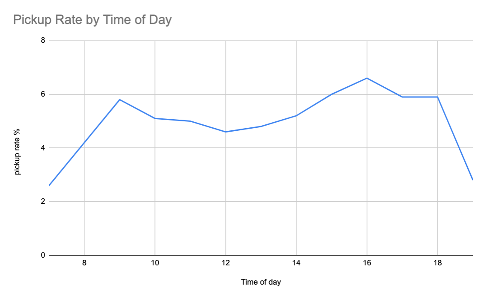
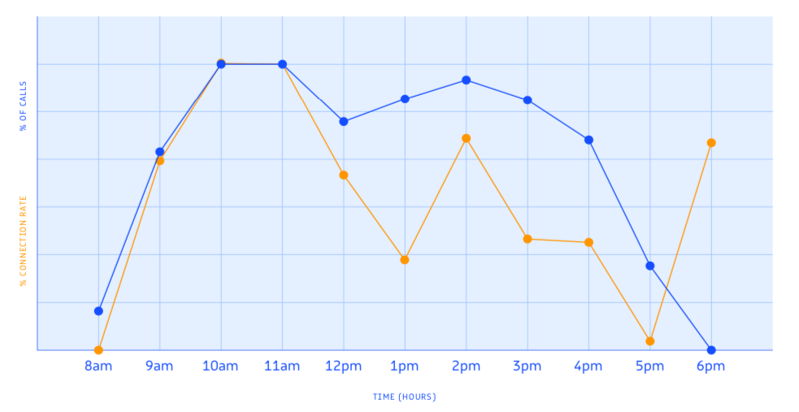
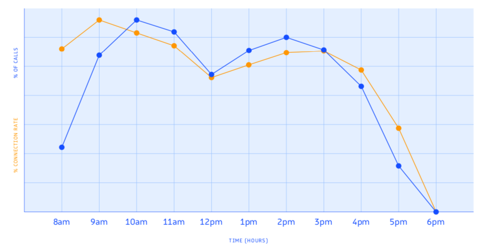
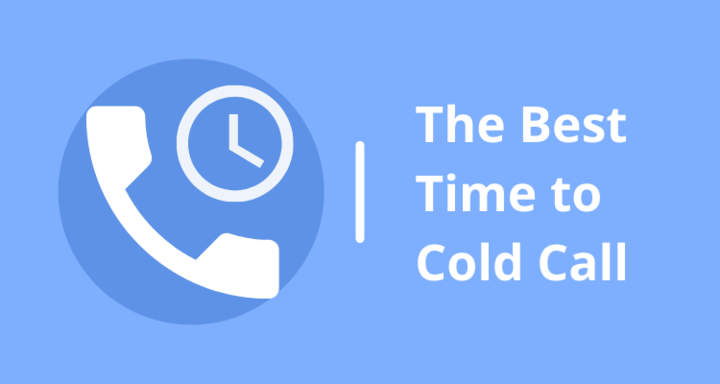

# When is the Best Time to Cold Call?

## Revenue.io launched a major study in 2019 to determine the optimal times of day for key Revenue-Generating activities. This included the best time to cold call prospects.

### When is the Best Time to Cold Call?

It is crucial to know when prospects are most likely to answer the phone. Even if reps are busy dialing all day, they should prioritize their most important outbound prospects at the times when they are most likely to engage.

It is now easier than ever to schedule calls and other outreach, such as emails and texts, during these key windows.

TOPO's sales leader research, now part of Gartner, shows that sales leaders place live call execution at the top of their list of priorities for new hires. This is a sign that cold calling is still a valuable channel for Revenue teams. It is important to know the best time to make cold calls.

Calling at the right time will maximize your answer rate and help you maximize Revenue opportunities.

#### Best Time to Cold-Call Prospects in 2022

We are frequently asked about best practices for outbound prospecting since we are a trusted source for building high-performing Revenue teams. This question comes up a lot...

> *"When should my reps dial their best prospects?"*

We thought it would be useful to analyze call data. The results were fascinating because they didn't match the results of Revenue.io's larger 2019 study. This could indicate a shift in behavior among key decision-makers.

What did we discover from the team's sequence call and dialer data?

*([Source](https://www.revenue.io/blog/the-best-time-to-cold-call-prospects-in-2020))*

Decision-makers are more likely to engage in the late afternoon. Peak engagement occurs between 4-5 p.m. and 6-8 p.m. This window is closely followed by the 3-4 p.m. and 5-6 p.m. hours.

What is the bottom line? Revenue teams should schedule outbound calls and campaign sequences during the late afternoon (3-8 p.m. in their time zone span).

These results were contrary to the 2019 study. These results are still going to be shared with you because they reflect a larger study that spans multiple industries.

You should also consider, especially if your company sells SaaS, the possibility of using late afternoon call blitzes for top leads.

### Why Prospecting in Late Afternoon Makes Sense

It is important to remember that prospects also have day jobs. They are more likely to focus on their job and not answer phone calls from strangers during the day. Slack threads become quieter in the afternoon, and co-workers may stop asking for help.

It is less likely that your prospect will be available for a Zoom call. This makes it less likely that they will pick up their phones while on a Zoom call.

Is it possible to make contact with prospects only in the late afternoon? Let's take another look at our 2019 data and see if there is another window that could be used for cold calling.

### 2019 Research – When is the best time for cold calling?

Revenue.io found that the best time to contact prospects (in their time zone) was in the late morning.

Cold calling in the morning is a good idea for many reasons. Although working professionals start their day at different times, most are in the office by late morning.

Meetings are often booked during these hours. However, this means that professionals expect to hear from people at this time of the day, which may increase their chances of answering the phone.

This chart provides a detailed breakdown:

*([Source](https://www.revenue.io/blog/the-best-time-to-cold-call-prospects-in-2020))*

This research data is only applicable to sales calls made through Revenue.io in 2019. It does not include calls between business professionals with preexisting relationships. A more useful chart for most sales reps would be to look at cold calls.

According to Revenue.io's 2019 call data, 9 a.m. in the recipient's local timezone is the best time to cold-call.

Call connection rates were the highest between 8 a.m. and 11 a.m. in the time zone where the person receiving the call is located.

Revenue Teammates could structure their day by prioritizing morning calls for block calls with their sequence or dialer tools.

This chart provides a detailed description of cold calling times and the time prospects pick up the phone according to our research.

*([Source](https://www.revenue.io/blog/the-best-time-to-cold-call-prospects-in-2020))*

Sales reps should not avoid calling prospects at times when there are lower connection rates. These are times when prospects are less likely to answer the phone. It doesn't mean that they *won't* answer the phone at those times.

It is important to prioritize the most promising prospects for the windows when they are most likely to answer.

### What are the Best Times to Cold Call?

#### Best Time of Day: Time Zone Specific

Prospecting calls are only effective when your phone call is answered. It is important to plan your day according to the working hours of your territory and to make your calls during peak connection rates.

If you're based on the East Coast and calling from the West Coast, you can start prospecting calls at 11 a.m. Call through 6 or 7 p.m. for maximum reach.

#### Wednesday and Thursday

Prospects tend to be more open to making deals on Wednesdays or Thursdays. They usually have enough time to review your offer.

### When to Avoid Cold Calling

**Outside of Work Hours**

These times are not only less likely to get connected, but they can also cause problems. It is not a good idea to call prospects during their private time.

**Worst Time of Day: Lunchtime**

The worst time to call prospects during work hours is around 1 p.m. Not only are they likely eating, but they might also be taking a break. This timeframe coincides with the energy drop-off observed in working professionals right after a lunch break. This is why many people feel a lack of energy and are less likely to talk to someone new over the phone.

**Worst Days: Monday, Tuesday, & Friday**

Many professionals use Monday and Tuesday to catch up and wrap up outstanding work from the previous week. They may not have the time to listen to your sales pitch because the first two days of the week are busy.

Most people look forward to Fridays. They might not be willing to take a call from someone they don't know on Friday if they don't have to.

**Other Times to Avoid: Weekends & Federal Holidays**

Cold calling on weekends is not a good idea, it's unprofessional no matter how clear and concise you are.

Cold calling on federal holidays makes you seem out of touch. It doesn't matter whether it's a strategic decision on your part, you won't get the result that you want. Keep in mind that deals are often stalled around holidays.

## Additional Nuanced Situations to Avoid Cold Calling

It's all about people, it's all about your prospects. Spend some time researching the prospect, their company, and any other ongoing campaigns.

If you see that their company has been featured in the media, find out why. If the news is negative, you should reschedule. Some examples of when to reschedule could be the day after a team member or family member has died or when the stock price of the company plunges.

It is unlikely that decision-makers will be motivated to invest in new partnerships or make new investments. BUT this depends on what you sell. If you are in cybersecurity, the *best* time is the day following a hack.

### Summary

Maximize your time cold calling by learning more about your prospects. Conduct thorough research on THEM, their company, and their motivations. A strong first connection creates a foundation for a long-lasting relationship and improves your success.

Spend the morning conducting research. Also, use the morning to structure your day and block your calendar during the optimal times to reach out to your top prospects.

Continue to follow up with each prospect - even if they don't respond to your first attempts at connecting. Being persistent and calling at different times and days increases your likelihood of making contact.