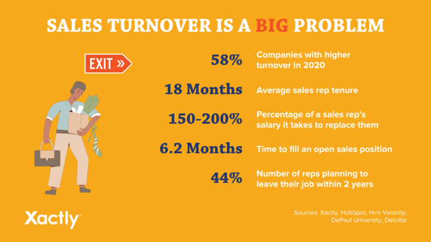

# Why Do I Hate My Sales Job?

## Do you hate your sales job? You're not alone. Reps are leaving companies faster than they can hire them, and it's not just sales departments that struggle.

### Are you pushing top Revenue Generators out of your company?

We have seen it all when it comes to selling. Before starting REVteam, Damian Thompson had a decades-long career in B2B software sales. He helped build the sales teams at major security software companies worldwide.

Some of the problems in his career were due to high turnover rates and high levels of stress and pressure.

These are the most common sales mistakes made by companies.

*([Source](https://www.xactlycorp.com/blog/sales-turnover-statistics))*

#### Lead Generating Roles Aren't Pulling Their Weight

Sales reps rely heavily on inbound and outbound lead generation to source new leads. There are often significant gaps between the marketing and sales teams. That's why Sales and Marketing are dead...it's all about the Revenue Team.

We define the ***REVENUE TEAM*** as any revenue-generating role where the success of the role is determined by hitting and exceeding Revenue Generating metrics. Positions such as sales, customer success, and inbound & outbound lead generation roles.

#### Too Many (Unnecessary) Meetings

For employees with too many meetings and conference calls, it can feel impossible to be productive. Although some meetings are essential to maintain information flow, excessive meetings can prevent salespeople from having enough time for revenue-generating activities.

Your salespeople should be spending their time meeting with potential customers and not in redundant internal meetings.

#### Customer Service Structure vs Customer Success Structure

Are you a company that makes it difficult for salespeople to deal with customer service? Salespeople are often tasked with handling customer service. This can hinder their ability to focus on the activities that generate sales.

This can be avoided by creating a Customer Success department within your organization - whose main job is to ensure the customer is getting the most value out of the tool. Customer Success roles are also measured by customer retention and account growth.

This may seem difficult to create. **BUT** what is the best way to grow revenue quickly? It's with your current customers. Investing time and resources in the growth and retention of existing accounts is well worth it.

#### Product is Unreliable

Selling a product that causes problems for customers is the worst thing for a sales rep. If the solution is not the right fit, the sales rep loses credibility and their productivity suffers as they look for solutions to the problem instead of selling.

#### Internal Processes are Broken

If your internal processes are so broken that sales reps spend too much time on their own, you need to find ways to fix them. Your company will lose deals to competitors who are more agile than you if it spends too much time trying to get things done.

#### Terminate Employment Threats

Ask any sales professional, and they will tell you that if they feel threatened by what they do, they will retreat to a protective shell to find another job.

Sales can be stressful! It shouldn't be stressful to make it seem impossible. This is not the best way to motivate salespeople. It is time for a rethink of your managerial strategy.

Sales professionals will tell you that if they feel threatened about the security of their job, they will eventually look for another job.

#### Unrealistic Goal Setting

It could be that goals are not realistic if the majority of your team doesn't hit the quota. This drives sales pros crazy because they know that in order to make the income they desire, they must hit or exceed their quota.

Sometimes salespeople wonder how they came up with this number. Explain the reasoning behind your sales goals. Instead of picking an unattainable number, try explaining the reasoning behind it.

#### Lack of Training

Many of us received training that included index cards listing the five most common objections and a list with phone numbers, all in alphabetical order. It was a lot like a phone book. Without being taught how to swim, you might have been thrown into the deep end.

Any business needs to have sales skills. If you're lucky enough to find a job that recognizes this and offers excellent training, you'll spend less time trying to swim against the water and taking in mouthfuls while your dog paddles to the side. Great training puts the team at ease and gives them a practical, tactical system for success.

#### Aggressive Sales Culture

You've probably seen the "hard sell" (a.k.a. salespeople in movies). "High pressure" sales. You can feel the pain if you've ever been a victim of this type of sale. There are laws that allow those who fall for these types of sales tactics to cancel a deal within three business days. The law allows for a "cooling off" period. This is not because you were too excited to buy something, but because you need to relax from the friction of dealing directly with this type of salesperson.

A great salesperson doesn't use pressure tactics or hard sell. Professional salespeople have never seen someone apply pressure to convince a prospect. To be a better salesperson, you don't have to be aggressive. Not everyone is a good fit. That's okay. Move on.

#### The Belief that Sales Doesn't Come Naturally

Selling can feel challenging, especially at the beginning. Even more so when you have to ask for the commitment for time (i.e., prospecting). Everything feels awkward when you don’t what you are doing. However, like anything else, you will become a better salesperson over time, but you can’t get better until you change the beliefs that are holding you back.

Here's a little secret, *sales doesn't come naturally to anyone*. All of the greats had to learn the hard way on their own. And even with their foundation of knowledge, it is still hard. It is something you will have to work on for the duration of your career.

### When you start asking yourself, "Why do I hate my Sales job?"

Think about these things. Neither lack of skill, nor any of these beliefs and experiences can make you a fatalist. You might find new beliefs that suit you better. You will have new experiences and the satisfaction of helping others get what they need.

You can also receive the training and development that will allow you to achieve greater success. If you want to become a better salesperson, then you must believe you can.