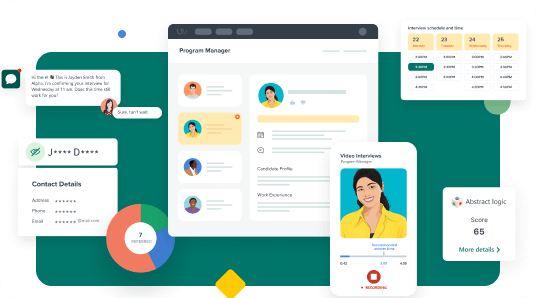
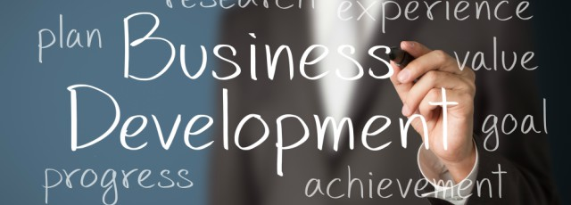

# Why Do You Want to be a Business Development Representative?

## As a BDR you'll be responsible for developing relationships with potential clients and helping them understand how your company's products or services can benefit their business.

### [What is a Business Development Representative (BDR)?](https://rev.team/kb/what-is-business-development-representative)

Why do you want to be a business development representative? Let's find out. A sales development representative is the primary point of contact between a business and its customers.

In this position, you build relationships with clients and network with others to persuade them to purchase a company's product or service.

As a sales representative, you're also responsible for identifying new business opportunities and customer leads. Your job also involves preparing the sales pitch, negotiating prices, and answering any questions or concerns that a customer might have.

### Questions for Business Development Representatives

Business Development Reps build relationships with potential customers and seek out new opportunities. They are usually under the direction of a Business Developer, who sets goals for the team and individuals. This is a crucial position, as business development reps are responsible for driving sales and long-term business growth.

Look for candidates who are enthusiastic about meeting sales quotas during your interview process. This role involves contacting potential clients daily and promoting your company’s products/services. Candidates who are driven, motivated, and take initiative are preferred.

Business Development Reps often work with internal teams (so strong communication skills are essential for this position).

Focus on candidates who can positively represent your company and are professional, as with all positions that require customer contact. Situational questions can help you understand how potential employees handle job-related challenges.

To learn more about candidates for senior positions, you can use Business Development Manager sample interview questions.

#### Operational and Situational Questions

* We are looking at expanding our business in [X] markets. What do you think are the pros and cons of this strategy based on what you know about our company and the competition? How would you implement it?
* You are trying to contact potential clients but they keep directing you to other employees. How do you find the right person to contact?
* Where would you go to find new opportunities?
* It's late and you're in a promising meeting. You might be late for your next appointment. How do you handle this situation?

#### Role-Specific Questions

* Describe the responsibilities you have when you are assigned a potential client. What is the first thing that you do when you are assigned a new client?
* Which sales techniques are you most familiar with? Which sales techniques are most effective and which are the least effective? Why?
* Are you familiar with CRM software? If yes, which CRM software tools have you used?
* What data are you required before you contact a potential client?

#### Behavioural Questions

* Are you a salesperson who has failed to meet a sales goal? What was the result?
* This role can be repetitive, presenting our company and products/services daily to multiple clients. What keeps you motivated?
* What is your greatest professional achievement? What are you most proud of?
* Describe a time when you had to deal with an angry customer. How did you handle the situation?

### 10 Essential Interview Questions and Answers for Sales and Business Development

If you have the gift of gab, and a passion to drive growth, what better way to put those skills to work than to do a sales or business development internship (aka biz dev)? It doesn't matter how sharp your tongue may be, it is always a good idea to be prepared.

After you have landed a job and learned the basics, make sure you are ready for the big day by reviewing these 10 essential interview questions and their answers for sales and business development interviews.

#### 1. Why would you like to work here?

This is your potential employer confirming you have done your research and are enthusiastic about the job. Know the company, the job, and why you would prefer to work there. Do your research, get a clear understanding of the company's mission, values, and then sell it:

> *"I started selling Girl Scout cookies when I was 7 years old. I loved it. Since then, I knew that I wanted to work in sales. The software products of [Company] have made my life so much easier. I would love to share them with others."*

> *"I have spoken to a few of your employees and think your collaborative culture would be a great fit. I love working with people, enjoy constructive feedback, and can delegate to get results."*

#### 2. Tell me about a sale that you lost.

It doesn't matter if your interviewer wants to know about your greatest sales achievement or your worst sales failure. It all comes down to how you frame the question. Focus on the lessons learned and show self-awareness.

Even if you're not a sales professional yet, don't worry. No problem, talk about any competitive situation and explain why you succeeded or failed:

> *"Last summer, in my first real sales role I lost a sale. I didn't take enough time to get to know the client and establish a long-term relationship. I then followed up with the prospect to learn how I could better serve her future needs.*

> *I have carried that knowledge forward to all future sales. It made a big difference in my sales numbers."*

#### 3. Where do you see yourself in five years?

Interviewers want to know if you are in sales development for the right reasons and a long-term career. It is important to make it clear that you are open to all possibilities and highlight what attracted you to the industry.

While you don't need to be looking for a specific job, it is important to set clear career goals that follow a natural progression through the internship to more senior positions in the industry:

> *"I would like to use this internship as a way to improve my sales and business development skills, identify growth opportunities, and learn everything I can about the industry. After graduation, I plan to become a full-time business development associate. I will then work my way up to business development manager."

#### 4. Tell me about a failure of yours and how it was resolved.

This interview question is similar to all negative questions. It's less about the situation than it is about your reaction. You should focus on the positive aspects of the failure and the lessons learned. This doesn't have to be a huge blunder.

You can define failure for yourself in your response. Then you can move on and discuss how you dealt with it. For this classic behavioural interview question, use the STAR method:

> *"Failure is not living up to the expectations of others, but also my expectations. Last year, in marketing class, we were given a group project and each person was assigned an assignment. I had a lot of papers due and got behind."*

> *"I didn't want my team to be burdened by giving me more work. Although I met the deadline, it wasn't my best work. My team could have worked with my team if I had communicated my lack of progress."*

> *"Although we did a great job on the project, I knew that I could have done more on my own. I communicate with every project from the beginning, providing regular updates and checking in on it."*

#### 5. How will you structure your day?

Business development and sales can be very exciting — but it can also be monotonous at times.

Emphasize that you have what it takes to stay motivated and stay on-task during those less-thrilling days, with a focus on the job description and your organizational and time management skills, since you’ll be juggling multiple clients and priorities.

Fine-tune this sample response to reflect your working style:

> *“I start every day by checking my calendar and reviewing my to-do list. I confirm my major priorities first, take care of those, and then move on to the other items on my list. If anything is unclear, I schedule a time to sit down with any relevant parties and clarify expectations."*

> *"I allot 15 minutes of review time before any meeting to ensure I’m prepared. And, I always take a 20-minute walk at lunch to clear my head.”*

#### 6. Walk me through your resume.

As a salesperson, you need to be well versed in selling your most important asset: You. Hit every sales role on your resume — and then discuss what you learned and how that knowledge makes you a good fit for this job.

Depending on your experience, a strong response might look like this:

> *“In high school, I worked at the local coffee shop after school. In addition to interacting with a diversity of clients every day, I led their business development efforts by recognizing their need to appeal to younger clients through a revamped social media presence, which led to new customers."*

> *"During the school year, I’m on the debate team, which has improved my confidence and eloquence, and I sing a cappella, which is all about working together as a team.”*

#### 7. Describe a time you went above and beyond to help a customer.

Your sales or business development internship will involve working directly with clients. Your potential employer wants to see that you are willing to do whatever it takes for the customer to be satisfied and, in turn, grow their business. Even if this is your first job in biz development/sales, you should focus on the positive interactions you have had:

> *"I was volunteering at my local food pantry last year, as a pantry assistant. After I finished my shift, I noticed an elderly woman waiting for her bus. She was carrying a cart full of food and was trying to balance several other bags."*

> *"I knew she lived near me, so I offered to take her home. I brought her groceries. We became carpool buddies for the rest of the summer because she was so grateful."*

#### [8. Sell me a pen.](https://rev.team/kb/how-to-sell-a-pen-in-an-interview)

Yes, it happens. It happens a lot. They might ask you to sell them your coffee or a pen.

Interviewers want to see your charisma, improvisational skills, and ability to answer follow-up questions. Before you start selling, ask some qualifying questions.

You want to get to know the customer's needs before you sell the product. A conversation is key to a successful sale.

Start by asking "Why?" and let the conversation flow naturally. Keep the conversation enthusiastic.

Close the deal by presenting a summary of your most important points.

> *"This coffee is strong, low-acidity, and will get you up for the day. You said you have a deadline. You'll be working through lunch and not feel it! Are you ready to place an order?"*

#### 9. Tell me about a time when you disagreed with a colleague. How did you resolve it?

Business can be stressful. Your interviewer wants you to show that you can keep calm, cool, collected, and focused. This classic question can be answered using the STAR method. Focus on the solution.

Keep your positive attitude!

> *"Even though our ideas were different about how to proceed with the group term paper, we sat down together and discussed how we could combine these ideas to present a stronger, more cohesive front to the professor. We were able to write a great paper by practicing empathy and understanding our classmate's perspectives."*

#### 10. How do you measure success in life?

Interviewers want to know what motivates and how you rate your achievements quantitatively. Your answer should reflect your definition of success, as well as how you compare to your potential employer.

Do your research beforehand, with a focus on the company's mission/vision/values, and fit your vision with theirs. Your response could be about achieving revenue goals, converting certain prospects, or updating an outdated system.

Since they're looking for specifics, use examples of your past achievements, and show how you met -- or, better yet, exceeded -- expectations. This is how a good answer should look:

> *"I measure success by understanding what is expected and then delivering above that. At my last internship, I was asked by the company to find contractors for our new website. I was able to find three and presented my findings based upon several key areas."*

> *"Then, I became the primary liaison with the vendor. I did more than what was asked. That, to me is a success."*

### Summary

Now you know the answer to the question "Why do you want to be a business development representative?" Reps are the beginning of every sales conversation and are crucial to a company's success.